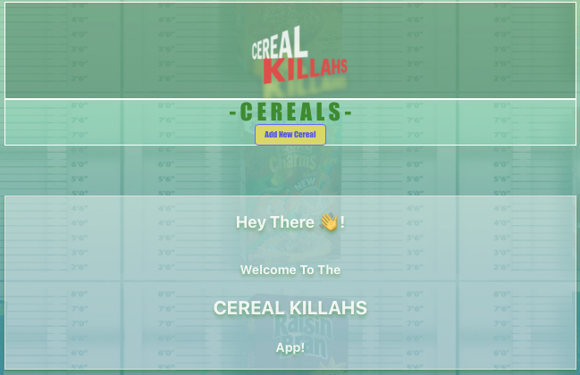
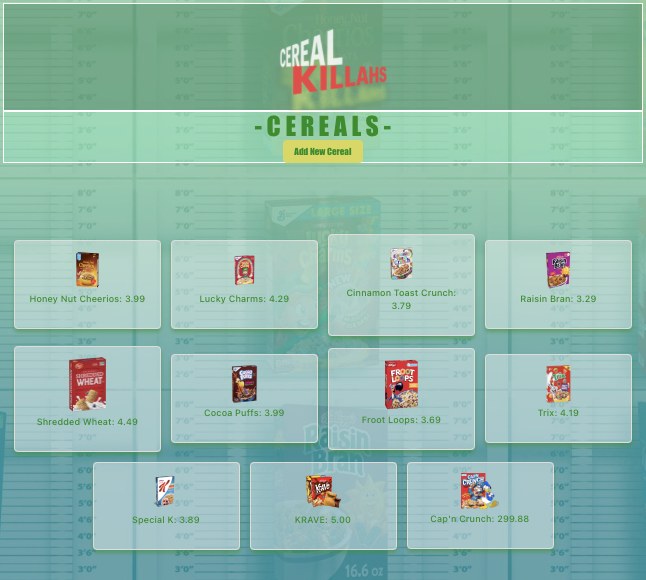
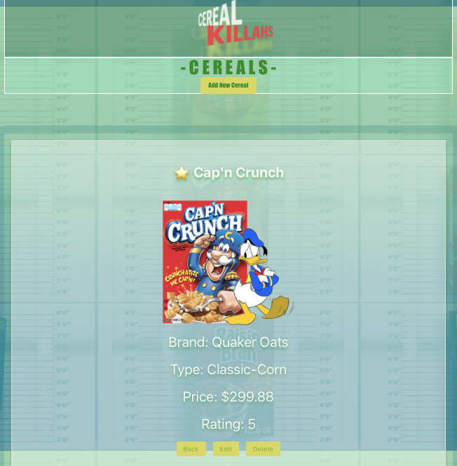

# Cereal-Killahs-FrontEnd

Hi, welcome to our Cereal Killahs app where we showcase cereals behind bars 🙃

Users can enter the site here [_Cereal Killahs Website_](https://cereal-killahs.netlify.app/)

# Our Site

Or you can follow these steps to run the codebase on your local server:
1. Fork & clone this repository
2. `npm i` or `npm install` to update and download the latest dependencies
3. Users should have or create a `.env` file and set these variables:

   > VITE_PORT=https://serial-killa-foreal.onrender.com
   > VITE_APP_URL=http://localhost:[your port that the backend will run on] -

   You can see instructions for the backend here [_Cereal Killahs Backend_](https://github.com/anickacodes/Cereal-Killahs-BackEnd/)

4. `npm run dev` to start up the server. Make sure the API variable in `CerealDetails.jsx`, `Cereals.jsx`, `CerealEditForm.jsx`, `CerealNewForm.jsx` matches the correct env.

Once on the site, users can click `'-CEREALS-'` to see a list of all cereals or go here: [_Cereals Page_](https://cereal-killahs.netlify.app/cereals/)

Users can click a cereal image or title to navigate to the individual cereal's page where they will see the following information:
- Name and whether it is a favorite⭐️
- Brand
- Type
- Price
- Rating

Users can click `'ADD NEW CEREAL'` and fill in all fields to add their own cereal killah to the database

Users can click `'Edit'` on an individual cereal's page and update any field

Users can click `'delete'` on an individual cereal's page, and once they click `'ok'` on the pop-up, the cereal will be deleted

